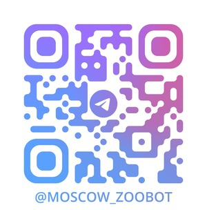

# Итоговый проект Телеграмм Бот Московского зоопарка

### Ссылка: [@moscow_zooBot](https://t.me/moscow_zooBot)
# Описание
Telegram-бота для популяризации программы опеки, помогающий пользователю подобрать животное.
Пользователь заполняет анкету. На основе ответов бот генерирует персонализированное сообщение с описанием подходящего животного и рассказывает о программе опеки. 
# Команды
- /start - запустить бота для заполнения анкеты <br>
- /connect - связаться с сотрудником зоопарка
- /feedback - оставить обратную связь
- /admin - админ панель для добавления и удаления вопросов и ответов из БД SQLite
## Установка
1. Клонирование репозитория\
``` git clone https://github.com/andrey01chirkin/Telegram_BOT_Moscow_Zoo.git ```
2. Переход в директорию Telegram_BOT_Moscow_Zoo\
``` cd Telegram_BOT_Moscow_Zoo ```
3. Создание виртуального окружения\
``` python -m venv venv ```
4. Активация виртуального окружения\
``` source venv/Scripts/activate ```
5. Установка зависимостей\
``` pip3 install -r requirements.txt ```
6. Открыть файл config.py
7. Переменной TOKEN присвоить токен
8. В списке admin_list укажите Ваш id в Телеграм для получения доступа к админ панели\
(узнать id с помощью бота <b>@getmy_idbot</b> в Telegram)
9. Запустить бота\
``` python -m app.run ```


